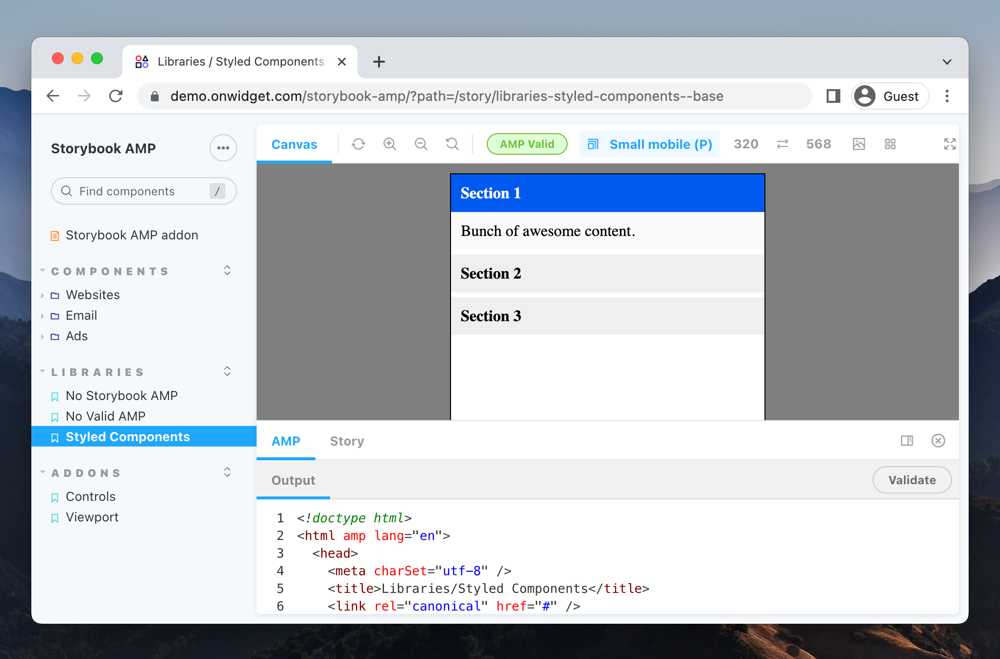

# Storybook AMP Html &middot; [](https://www.npmjs.com/package/storybook-amp)

Storybook addon for [AMP (Accelerated Mobile Pages)](https://amp.dev/). Allows to display in your stories *AMP Html* components generated with React.



<details open="open">
<summary>Table of Contents</summary>

- [Features](#features)
- [Demo](#demo)
- [Getting Started](#getting-started)
  - [Installation](#installation)
  - [Configuration](#configuration)
  - [Usage](#usage)
  - [Examples](#examples)
- [Roadmap](#roadmap)
- [Contributing](#contributing)
- [License](#license)
- [Acknowledgements](#acknowledgements)
- [Links](#links)

</details>

<br />

## Features

- Deliver in each story the output code (AMP ready) resulting from the SSR.
- Works with [AMP websites](https://amp.dev/about/websites/), [AMP email](https://amp.dev/about/email/) and [AMP ads](https://amp.dev/about/ads/)
- Realtime AMP validation.
- Adds addon panel to also validate the story (using online [AMP Validator](https://validator.ampproject.org/)) and view the output code.
- Support Styled Components using a custom render function

## Demo

- [Storybook AMP Html Demo](https://demo.onwidget.com/storybook-amp/)

<br />

## Getting Started

### Installation

```sh
npm install -D storybook-amp
```


### Configuration

Next, update `.storybook/main.js` to the following:

```js
// .storybook/main.js

module.exports = {
  stories: [
    // ...
  ],
  addons: [
    // Other Storybook addons

    'storybook-amp', // 👈 The addon registered here
  ],
};
```


### Usage

To set custom settings, use the  `amp` parameter. 

```js
// .storybook/preview.js

const scripts = '';
const styles = '';

export const parameters = {
  // Other defined parameters

  amp: {              // 👈 The addon parameters here
    isEnabled: true,  // Enable the addon, false by default (boolean)
    scripts,          // Global scripts to add, empty by default (string)
    styles,           // Custom css styles, empty by default (string)
  },
};
```

You can use the `amp` parameter to override settings on each story individually:

```js
// Story example

export default {
  title: "Components/amp-youtube",
  parameters: {
    amp: {
      scripts: // 👈 Script needed by the story
        `<script async custom-element="amp-youtube" src="https://cdn.ampproject.org/v0/amp-youtube-0.1.js"></script>`,
    },
  },
};

export const Story = (args) => (
  <amp-youtube
    width="480"
    height="270"
    layout="responsive"
    data-videoid='lBTCB7yLs8Y'
  ></amp-youtube>
)
```

### Examples

- [React](https://github.com/onwidget/storybook-amp/tree/main/example)
  
<br />

## Roadmap

- Make it compatible with the *Chromatic addon*
- Make it compatible with the *Accessibility addon*
- Adjust UI details when used with *Docs addon*
- More tools for *AMP Ads* and *AMP Email*
- Add more example tests
- Add tests
- Make CI integration possible

<br />

## Contributing

Storybook AMP Html addon is an open-source project. We are committed to a fully transparent development process and appreciate highly any contributions. Whether you are helping us fix bugs, proposing new features, improving our documentation or spreading the word - we would love to have you as part of the community.

Please refer to our [Contribution Guidelines](https://github.com/onwidget/storybook-amp/blob/main/CONTRIBUTING.md) and [Code of Conduct](https://github.com/onwidget/storybook-amp/blob/main/CODE_OF_CONDUCT.md).

## License

The Storybook AMP Html addon is licensed under the MIT license — see the [LICENSE](https://github.com/onwidget/storybook-amp/blob/main/LICENSE) file for details.

## Acknowledgements

Initially created by [onWidget](https://onwidget.com) and maintained by a community of [contributors](https://github.com/onwidget/storybook-amp/graphs/contributors).

## Links

- [AMP Project](https://amp.dev/)
- [Awesome Amp](https://github.com/onwidget/awesome-amp)
